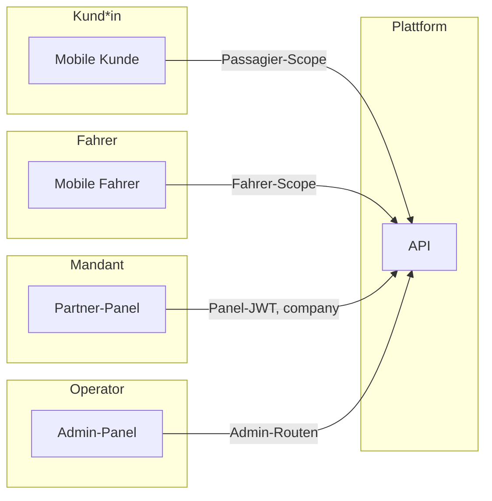

# Onroda / imoove — Betriebslogik: offene Produkt- & Systemmodule (Zielbild)

**Zweck:** Dauerhafte **Referenz** für künftige Features und Abstimmung.  
**Geltungsbereich:** Fachlogik, Rollen, Schichten, **kein** Ersatz für detaillierte API-Spezifikationen.

**Status-Hinweis:** Die hier beschriebenen Teile sind **Zielbilder** bzw. **offene bzw. teilweise umgesetzte** Module. Nur wo im Repo **explizit** anders dokumentiert oder im Code sichtbar steht, ist etwas **fertig** — alles andere bitte **nicht** als voll produktiv lesen, ohne Prüfung.

**Leitplanken (verbindlich im Team):**

- **Rollen- und API-Trennung:** siehe `.cursor/rules/imoove-product-architecture.mdc`, `imoove-pr-role-separation.mdc`, `imoove-panel-ux-separation.mdc`, `AGENTS.md`.
- **Kern-Policy (Taxi / Preis / Matching / Storno):** `docs/onroda-core-policy-taxi-mietwagen-storno.md` (wenn fachlich relevant).
- **Diese Datei** ergänzt die Architektur um **Betriebs- und Produktmodule**, die **über** den aktuell sichtbaren Code hinaus geplant oder nur teilweise adressiert sind.

---

## Schichtenüberblick (Kurz)

| Schicht | Typische Nutzung |
|--------|-------------------|
| **Marketing** (`onroda.de` / `www`) | Öffentlich, kein Default für eingeloggte Web-App |
| **API** (`api.…`) | App-Backend, OAuth, Sessions, Fachlogik, Mandantentrennung |
| **Mobile** | Kund\*innen-App, Fahrer-App (getrennte Personas/Flows) |
| **Partner-Panel** | Mandant: „Ihr Unternehmen“, JWT mit `company_id` |
| **Admin-Panel** | Plattform-Operator: global/mandantenbezogen je Route, **nicht** Partner-Fläche |

---

## 1. Kunden- / Fahrgast-Support (Admin → Kund\*innen)

**Zielbild:** Operative **Plattform-Sicht** auf Personen, die in der Kunden-App buchen, inkl. **Support** und **Massnahmen** — **ohne** Verwechslung mit **Partner-**Mandant-Logik.

| Baustelle | Inhalt (Ziel) |
|----------|----------------|
| **Kundenliste** | Suche, Filter, Sortierung, Pagination |
| **Kundenakte** | Stammdaten, Verknüpfung zu Identität/Profil, Sperr-Flags |
| **Fahrtenhistorie** | Nur Fahrten dieses Kunden; im Admin ggf. mandantenübergreifend **filterbar**, aber mit klarem Datenzweck |
| **Support-Tickets** | Eigener Kanal oder Anbindung an Support-Inbox; Trennung Support vs. reines Fach-Backoffice |
| **Account sperren/entsperren** | Klarer Admin-Effekt; Sessions/Logik abgleichen |
| **Datenschutz** | Nur **fahrt- und supportrelevante** Daten; Minimalprinzip, Retention/Löschung nach unternehmerischer Policy |

**Status:** *Offen / Zielbild* — Umfang und Endpoints bewusst pro Epic festlegen, nicht „alles in eine Admin-Liste mischen“.

---

## 2. Billing / Monatsübersicht (pro Mandant)

**Zielbild:** Abrechnung **je Mandant** mit nachvollziehbarem Lebenszyklus und Export, nicht ein undifferenzierter Sammel-Export.

| Baustelle | Inhalt (Ziel) |
|----------|----------------|
| **Monatsübersicht** | Pro `company_id`, Abrechnungsperiode, Aggregation aus fahrbaren/vertraglich relevanten Ereignissen |
| **PDF/CSV** | Export für Buchhaltung und Mandantenkommunikation |
| **E-Mail-Versand** | Z. B. **nach expliziter Admin-Freigabe** (kein unbeabsichtigter Massenversand) |
| **Status** | Z. B. **Entwurf → geprüft → gesendet → bezahlt** (exakte Werte & Übergänge: festzulegen) |
| **Vorlagen** | Unterschiede nach **Taxi, Hotel, Krankenkasse, Unternehmen** (Inhalt, Pflichtangaben) |

**Status:** *Offen / Zielbild* — Abgleich mit vorhandener Abrechnungs-/Fakturierungs-Strategie im Produkt nötig.

---

## 3. Krankenfahrt / Krankenkasse (fachliche Grenze)

**Zielbild (Datenminimalismus):**

- **Keine Diagnosen** und keine unnötigen Gesundheitsmerkmale; nur fahrt- und abrechnungsrelevante Felder.
- Typisch: **Fahrt**, **Kostenstelle / Referenz / Aktenzeichen** (pro Kostenträger definiert), **Zahler-Logik**, **Status** der Fahrt/Abrechnung.

**Rollen (Begrifflich trennen):**

| Rolle | Kurzbeschreibung |
|--------|------------------|
| **Fahrgast** | betroffene Person / Bucher in der App, keine Fremdmandanten-Sicht |
| **Kostenträger** | z. B. Krankenkasse — Referenzen, nicht operative Flottensteuerung |
| **Taxi (Mandant)** | ausführendes Transportunternehmen, Flotte, Disposition, Partner-Panel-Scope |
| **ONRODA (Plattform)** | Verträge, Freigaben, Sperren, plattformweite Operatoren- und Abrechnungsfälle |

**Status:** *Offen / Zielbild* — Begriffskatalog und UI-Strings vereinheitlichen, API-Routen strikt an Rolle + Mandat koppeln.

---

## 4. Einheitliche Statusmodelle (Referenz, zu vereinheitlichen)

**Zielbild:** Pro Domäne **eine** nachvollziehbare Menge an Statuswerten und **klare Übergänge**; dieselben Begriffe in **API (snake_case)**, **Admin/Partner-UI (Lesetext)**.

| Domäne | Ziel: Status + wer setzt (Owner) |
|--------|----------------------------------|
| **Unternehmen** | aktiv, Sperre, Verifizierung, Compliance, Vertrag (Kernspalten) |
| **Fahrer** | aktiv, Sperre/Freigabe, ggf. Partner- vs. Admin-wirksam, **Readiness** (gesondert, aber sichtbar verzahnt) |
| **Fahrzeuge** | Entwurf, in Prüfung, freigegeben, abgelehnt, gesperrt |
| **Fahrten** | Suche, aktiv, abgeschlossen, storniert — konsistent mit Produkt- und Storno-Policy |
| **Rechnungen** | s. Modul 2 |
| **Support-Tickets** | offen, beantwortet, geschlossen (o. ä.) inkl. Nachvollziehbarkeit |

**Status:** *Offen* — Soll einmal als kurze **State-Machine-Übersicht** (pro Objekt) ergänzt werden, abgeglichen mit `schema` und Audit-Log.

---

## 5. Sperr- / Freigabe-Rechte (Dokumentation)

**Grundregeln (Zielbild, mit bestehenden Architektur-Regeln konsistent):**

| Ebene | Darf (Anker) |
|--------|----------------|
| **Plattform-Admin** | Global freigeben/sperren, wo die API Plattform-Admin vorsieht; Mandanten-, Fahrer-, Fahrzeug- und ggf. Kund\*innen-Massnahmen je Route |
| **Partner** | Nur **eigener** Mandant: self-service, Flotte, Einreichungen, **keine** fremden Fahrten |
| **Fahrer** | Operativ: Online/Offline, Annahme **nur** im Rahmen **Readiness**; keine Mandanteneinstellungen |
| **Kund\*in** | Nur **eigene** Fahrten, Profil, Storno laut harter Policy |

**Audit:** Sperr-/Freigabe-Aktionen, wo fachlich vorgesehen, in **Mandantenkontext** nachvollziehbar (vgl. `panel_audit_log`).

**Status:** *Teilweise* im Code umgesetzt; Matrix **Rolle × Objekt × Aktion** als laufend zu pflegende Doku-Referenz sinnvoll.

---

## 6. UI-Standard (Dauer-Constraint)

| Fläche | Richtschnur |
|--------|-------------|
| **Admin-Panel** | **Mandantenzentrale-Optik** (Karten, Header, ruhige Typo) — Plattform- / Operator-Charakter |
| **Partner-Panel** | **Eigener Arbeitsplatz** (Ihr/Mein, anderes Theming) — bewusst **nicht** 1:1 an Admin anpassen |
| **Mobile** | Fahrer und Kund\*in klar getrennt (Flow, ggf. App-Einstieg); **kein** Vermischen der Personas in einer Oberfläche |
| **Allgemein** | **Keine Fremd-Layouts**; Marken-Common ok, **Persona** trotzdem unterscheidbar |

**Status:** Verbindlich über Cursor-Regeln und laufende PR-Checks; diese Datei **dokumentiert** die fachliche Einbettung.

---

## 7. Fahrtakten (eigenes Modul) — *Zielbild*

**Begriff:** Eine **Fahrtakte** fasst **eine** Fahrt (Ride) in einer **einzigen, nachvollziehbaren Kette** für berechtigte Leser: Zeitachse, Statuswechsel, Storno, Zuweisung, ggf. Support- und Abrechnungs**Verweise** — **ohne** fachfremde Daten zu vermischen.

| Aspekt | Inhalt (Ziel) |
|--------|------------------|
| **Kernobjekt** | 1:1 (oder 1:wenige definierte Unterobjekte) pro **Ride-Id** |
| **Ereignis-/Zeitachse** | Status, Zuweisung, Annahme, Fahrer-, Kunden- und Systemereignisse (Umfang: zu definieren) |
| **Lesende Rollen** | Kund\*in: nur **eigene** Fahrt; Partner: **eigener** Mandant; Admin: laut Admin-Route und Zweck; Fahrer: zugehöriger Auftrag |
| **Grenze zu Support** | Fahrtakte = **Ablauf** der Fahrt; Support-Tickets = **Korrespondenz/Case**; Verknüpfung über Referenz möglich, **kein** doppelter Wahrheits-Stack |
| **Grenze zu Rechnung** | Verweis/Status aus Modul 2, keine doppelte „Rechnungsfachwelt“ in der Fahrtakte |

**Nicht** Ziel: eine Fahrtakte, die heimlich Admin-Globalstatistik oder fremde Mandanten-Fahrten erscheinen lässt.

**Umsetzung (Stand, nur Plattform-Admin, read-only):**

- **API:** `GET /api/admin/rides/:id/record` — liefert `ride`, `events` (`ride_events` chronologisch), `panelAudit` (Mandant, `subject_id` = Fahrt) und `links` (`billing_reference`, optionale Vorbereitung `supportTicketId` / `supportThreadId` aus `partner_booking_meta`).
- **UI:** Seite **Fahrtakte** in `admin-panel` (Einstieg: Fahrtenliste → „Fahrtakte (Ereignisse)“ oder Tages-Agenda; gleiche Sichtbarkeit wie Fahrten nach Rolle).

**Status (Erweiterungen):** *teils offen* — tiefere Ereignis-Typen, fachlich einheitliche Beschriftungen, Partner-/Kund\*innen-Sicht separat. **Keine** Ersatzdefinition für geltende Storno-Policy.

---

## 8. Benachrichtigungslogik (eigenes Modul) — *Zielbild*

**Begriff:** Zentrales **Konzept**, **wer** wann **welches** Ereignis in **welchem** Kanal (push, e-mail, in-app, ggf. SMS) erhält — abhängig von **Rolle**, **Einwilligung**, **Produktlinie** (Taxi vs. Krankenfahrt vs. Hotel) und **Betriebswunsch** (kein Spam, Retry, Dead Letter).

| Aspekt | Inhalt (Ziel) |
|--------|------------------|
| **Ereignisquelle** | Statuswechsel Fahrt, Zuweisung, Storno, Abrechnung, Support-Antwort, ggf. Mandant-Freigabe |
| **Kanal** | Mindestens **E-Mail-Vertrieb (admin-freigabe-pflichtig vs. sofortigen System hin)** und **In-App**; Push nach Plattform-Entscheid |
| **Mandantentrennung** | Keine Misch-Newsletter; Partner sieht/empfängt kein fremdes Mandat |
| **DSG/Opt-in** | Marketing vs. transaktionell; Aufbewahrung; Abmelde- und Betroffenenrechte |
| **Technik (Referenz, nicht vorschreiben)** | Queue, Idempotency, Wiederholung bei Ausfall, Logging **ohne** Inhalte sensibler Gesundheitsdaten, wo nicht erlaubt |

**Status:** *Offen / Zielbild* — Implementierungsstand im Repo bewusst pro Feature abgleichen; **kein** Ersatz für laufende SMTP- oder Nginx-Runbooks.

---

## Wartung dieser Datei

- **Bei** neuen großen Epics: Abschnitt ergänzen oder *Status* präzisieren („erste UI da“, „nur API-Skizze“).
- **Nicht** hier API-Pfade 1:1 abhandeln; dafür `artifacts/api-server/docs/` und PR-Beschreibungen.
- **Cross-Impact**-Check je Änderung wie in `.cursor/rules/onroda-cross-impact.mdc` erwähnt, wenn es um sichtbare Produkte geht.

---

*Letzte inhaltliche Ergänzung: Fahrtakte (Abschnitt 7), Benachrichtigungslogik (Abschnitt 8), Kennzeichnung Zielbild/offen.*
