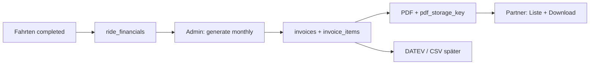

# ONRODA: Rechnungs- & Abrechnungsarchitektur (Partner / Hotel / B2B)

**Stand:** Architektur-Fundament im Repo (Migration **028**, API-Routen Panel, serverseitiges PDF).  
**Nicht** dasselbe wie die Einzelfahrt-Rechnung in `partner_booking_meta` (Krankenfahrt/Taxi pro Ride).

## Zielbild

| Bereich | Partner-Panel (`panel.onroda.de`) | Plattform-Admin (`admin.onroda.de`) |
|--------|-----------------------------------|-------------------------------------|
| Monatsabrechnungen | Liste, Detail, PDF-Download | Erzeugen, Freigabe, Mark paid, Export |
| Einzelaufstellung | `invoice_items` je Rechnung | Vollständige Sicht alle Mandanten |
| Zahlungsstatus | `open` / `due` / `overdue` / `paid` / … | Gleiche DB, globale Filter |
| DATEV / Export | später | später (`/admin/finance/…`) |

Mandanten-Typen (Hotel, Corporate, Kasse, Voucher, Taxi, Medical) nutzen **dieselbe** Finanz-Kernschicht; UI-Module steuern Sichtbarkeit (`billing`, `hotel_mode`, `company_rides`, …).

## Datenmodell (Quelle der Wahrheit)

**Migration:** `artifacts/api-server/src/db/migrations/028_financial_core_tables.sql`  
**Drizzle:** `invoicesTable`, `invoiceItemsTable` in `artifacts/api-server/src/db/schema.ts`

### `invoices`

- `company_id` → Mandant (`admin_companies.id`, TEXT)
- `invoice_type`: `partner_invoice` \| `operator_settlement` \| `credit_note`
- `billing_period_start` / `billing_period_end`
- Beträge: `subtotal_net`, `vat_total`, `total_gross`
- `issue_date`, `due_date`
- `status`: `draft` \| `issued` \| `partially_paid` \| `paid` \| `overdue` \| `cancelled`
- `pdf_storage_key`: relativer Pfad unter `PANEL_INVOICE_UPLOAD_DIR`
- `metadata_json`: z. B. `notes`, Export-Hinweise, Kostenträger

### `invoice_items`

- `invoice_id`, optional `ride_id`
- `item_type`, `description`, Mengen/Netto/MwSt/Brutto
- `metadata_json`: z. B. Zimmer, Gutschein-Code, Kostenstelle

### Später (optional)

- `invoice_status_history` — Audit der Statusübergänge (noch nicht migriert)

### Verboten / entfernt

- ~~`onroda_invoices`~~ (WIP-Tabelle, **nicht** verwenden)
- ~~`079_invoices.sql`~~ (Duplikat, gelöscht)
- Keine JSON-only-Rechnungen ohne `invoice_items` auf `main`

Verwandt, aber getrennt:

- **`ride_financials`** — Bewertung je Fahrt vor Fakturierung
- **`partner_booking_meta.invoice_*`** — Einzelfahrt-PDF (z. B. Medical), Route `POST /panel/v1/rides/:id/create-invoice`

## API-Schichten

### Partner (JWT, `company_id` aus Session)

| Methode | Route | Datei |
|--------|-------|--------|
| GET | `/api/panel/v1/invoices` | `routes/panelInvoiceRoutes.ts` |
| GET | `/api/panel/v1/invoices/:id` | ↑ |
| GET | `/api/panel/v1/invoices/:id/pdf` | ↑ |

- Modul: `billing` muss aktiv sein
- Permission: `rides.read` (bis `billing.read` eingeführt ist)
- **Immer** `company_id` aus JWT filtern — keine fremden Rechnungen

Datenzugriff: `db/panelInvoicesData.ts`  
PDF: `lib/invoicePdfServer.ts` (`buildPartnerMonthlyInvoicePdf`)

### Admin (Bearer / Session, global)

Bereits vorhanden (Financial Core):

- `GET /api/admin/finance/invoices`
- `GET /api/admin/finance/invoices/:invoiceId`

Datenzugriff: `db/adminFinanceData.ts`

**Geplant (Phase 2):**

- `POST /api/admin/invoices/generate` — Monatslauf aus `ride_financials` + abgeschlossenen Fahrten
- `POST /api/admin/invoices/:id/mark-paid` — Status + optional `payments`-Zeile

## PDF (Corporate B2B-Layout)

- **Nur serverseitig** — `pdfkit` + modulare Komponenten unter `artifacts/api-server/src/lib/invoice/`
- **Referenz-Optik:** Admin `InvoicesPage` Print-View (ONRODA-Wortmarke, Karten, rote Summe, Tabellenzeilen)
- **Zentral:** `invoiceBrand.ts` (Rechnungssteller Vedat Öztürk, IBAN, St.-Nr., Farben)
- **Komponenten:** `invoicePdfComponents.ts` (Kopf, Meta-Leiste, Parteien, Tabelle, Summen, Bank, Footer)
- **Mehrseitig:** `partnerInvoicePdf.ts` — Tabellenzeilen mit Seitenumbruch + kompakter Folgekopf
- Partner-Download: gespeichertes PDF (`pdf_storage_key`) oder on-the-fly + optional Disk-Cache
- **Kein** dauerhaftes Frontend-Fake-PDF (Hotel-Demo nur Übergang)

Lokale Probe-PDF: `pnpm --filter @workspace/api-server run test:invoice-pdf-sample`  
Layout-Stress (Mehrseiten, Umlaute, lange Texte): `pnpm --filter @workspace/api-server run test:invoice-pdf-stress`

**Roadmap (nicht Phase 1):** Logo-Asset, Status bezahlt/offen/überfällig + Admin mark-paid, Zahlungs-Historie, PDF-Regeneration, DATEV/CSV, Mahnlogik, Verwendungszweck-Matching; Partner-UI: Demo-Abrechnung entfernen → echte `/panel/v1/invoices`.

**Hotel-Panel:** Der lokale Demo-PDF-Button in `AgenturMasterPanel.jsx` ist **UX-Prototyp** — Ziel-Anbindung: `GET …/invoices/:id/pdf` via `partner-panel/src/lib/panelInvoicesApi.js`.

## Erzeugungs-Pipeline (Phase 2)

1. Fahrten mit abrechenbarem Status aggregieren (Filter: `company_kind`, Zeitraum, `billing_mode`)
2. `invoice_items` pro Fahrt/Zeile
3. Summen auf `invoices` schreiben, Status `issued`
4. PDF erzeugen, Key persistieren
5. Partner sieht Rechnung; Zahlung → `paid` / `payments`

## Rollen & UX

- **Partner:** „Ihre Abrechnung“ — kein Zugriff auf andere Mandanten
- **Admin:** „Plattform-Rechnungen“ — alle Firmen, Erzeugung/Storno
- Admin- und Partner-Panel **getrennte** SPAs und Copy (siehe `imoove-panel-ux-separation.mdc`)

## Deploy / DB

- Tabellen aus **028** müssen auf Produktion existieren (`verify-onroda-db-schema.sql`)
- **Kein** halbfertiger Import nach `export default router`
- API-Build auf dem Server nach Pull
- Upload-Verzeichnis: `PANEL_INVOICE_UPLOAD_DIR` oder Default `artifacts/api-server/uploads/panel-invoices`

## Dateien (Referenz)

| Pfad | Rolle |
|------|--------|
| `db/panelInvoicesData.ts` | Partner-Queries + DTO-Mapping |
| `db/adminFinanceData.ts` | Admin-Listen/Detail |
| `lib/invoicePdfServer.ts` | Öffentliche API (`buildPartnerMonthlyInvoicePdf`) |
| `lib/invoice/invoiceBrand.ts` | Logo-Farben, Rechnungssteller |
| `lib/invoice/invoiceLayout.ts` | A4, DIN-Ränder, Seitenkontext |
| `lib/invoice/invoicePdfComponents.ts` | Kopf, Footer, Tabelle, Summen, Bank |
| `lib/invoice/partnerInvoicePdf.ts` | Mehrseitiges Dokument |
| `lib/invoice/mapInvoiceItemForPdf.ts` | DB-Zeile → PDF-Zeile |
| `routes/panelInvoiceRoutes.ts` | Partner-HTTP |
| `routes/panelRouteContext.ts` | Gemeinsame Panel-Auth-Helfer |
| `routes/panelApi.ts` | Einzelfahrt-Rechnung (bestehend) |

## Auswirkungen (Kurzblock)

| Punkt | Status |
|-------|--------|
| API/DB | ja — 028 + neue Panel-Routen |
| Admin-Panel | ja — bestehende Finance-Invoices-Seite |
| Partner-Panel | ja — API bereit; UI Hotel noch Demo → Anbindung |
| Mobile | n. a. |
| Marketing | n. a. |
| Audit | später `invoice_status_history` |
| E-Mail | später Zahlungserinnerung |
| Rechte | `billing`-Modul + `rides.read` |
