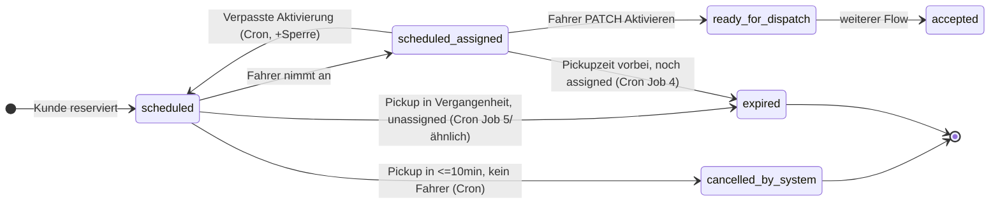

# Reservierungs-Flow: E2E-Testmatrix, Edge-Cases, Race-Conditions, Statusdiagramm

**Stand:** Nach technischer Umsetzung AUFGABE 1–5; **Auto-Promotion** `scheduled_assigned` → `ready_for_dispatch` per Read-Pfad wurde entfernt (`ridesData.ts`, separates Ticket).  
**Zweck:** Manuelle / instrumentierte E2E-Prüfung, bekannte Lücken, Freigabe für Commit/Deploy nur nach erfolgter Matrix + Dokumentations-Review.

---

## Referenz im Code (kurz)

| Thema | Ort |
|--------|-----|
| Cron: kein Fahrer, Reminder, verpasste Aktivierung, Expired | `artifacts/api-server/src/index.ts` |
| Lesepfad: `scheduled` + Abholzeit vorbei → `expired` (DB-Update), **kein** Auto-`ready_for_dispatch` | `artifacts/api-server/src/db/ridesData.ts` (`expirePastOpenReservationsByIds`, `withLifecycleExpiredRows`) |
| Fahrer: „Aktivieren“-Sichtbarkeit (0–45 Min vor Abholung) | `artifacts/mobile/app/driver/dashboard.tsx` (`canActivate`, `minutesUntil`) |
| Storno-Sperre Kunde/Fahrer (≤60 Min bis Abholung) | `artifacts/api-server/src/lib/rideReservationStornoDeadline.ts`, `artifacts/api-server/src/routes/rides.ts` |
| WS Join + Auth | `artifacts/api-server/src/wsRideSocketHub.ts`, `artifacts/api-server/src/lib/wsRideJoinAuth.ts` |
| WS Client Reconnect | `artifacts/mobile/utils/socket.ts` |
| Market-Rides ohne Reservierungs-Status | `artifacts/api-server/src/routes/fleetDriverApi.ts` (`market-rides` filter) |
| Reservierungs-Sperre Fahrer | `artifacts/api-server/src/db/fleetDriversData.ts`, Readiness `artifacts/api-server/src/db/fleetDriverReadiness.ts` |
| Kunden-Status-Copy | `artifacts/mobile/utils/customerRideStatusLabel.ts`, `app/status.tsx`, `app/my-rides.tsx` |

---

## Testmatrix (1–11)

### 1. `scheduled` ohne Annahme

| Schritt | Erwartung | Code-/Produkt-Hinweis |
|---------|-----------|----------------------|
| Kunde reserviert | Fahrt `scheduled`, `scheduled_at` gesetzt | |
| Niemand nimmt an | Status bleibt `scheduled` bis Cron greift | |
| Bis 10 Min vor Abholung „offen“ | Cron setzt `cancelled_by_system` erst wenn `scheduled_at <= now + 10min` (**Pickup in ≤10 Minuten**, noch ohne Fahrer) | `index.ts` Job 1: `lte(ridesTable.scheduled_at, cancelThreshold)` mit `cancelThreshold = now + 10min` |
| Danach `cancelled_by_system` | + Push „kein Fahrer“ (Expo) | `notifyPassengerRideCancelledBySystem` |
| `reservation_unfulfilled` | **Nur Kunden-UI-Phase** bei `expired`/`rejected` + geplanter Abholung – **nicht** identisch mit Cron-Job 1 | `app/status.tsx` `rawPhase` |
| Kunde sieht **nie** „Fahrer unterwegs“ bei reiner Reservierung | Solange nur `scheduled` / `scheduled_assigned` ohne `ready_for_dispatch` in `passengerAcceptedRequest`-Logik: keine Uber-Leiste mit Live-Fahrt | Prüfen: `RideRequestContext` `passengerAcceptedRequest` enthält `ready_for_dispatch` erst ab diesem Status |

**E2E-Checkliste:** API-DB-Zeit manipulieren oder Abholzeit in 12 Min legen, keine Annahme → nach Cron-Tick (max. **2 Min** Intervall) Status prüfen.

---

### 2. `scheduled` → `scheduled_assigned`

| Schritt | Erwartung |
|---------|-----------|
| Fahrer nimmt an | `tryFleetAcceptRideAtomic` / PATCH: `scheduled` → `scheduled_assigned`, `driver_id` gesetzt |
| Kunde Push | Einmalig, Dedupe-Spalte `push_customer_reservation_assigned_at` |
| Fahrer UI | Reservierung unter angenommenen / Planer-Ansichten |
| Kunde UI | „Meine Fahrten“ / Status: Spez-Texte AUFGABE 5 |

---

### 3. Aktivieren-Button (Fahrer-App)

| Schritt | Erwartung | Hinweis |
|---------|-----------|---------|
| 46 Min vorher | Button **nicht** aktiv (Hinweistext) | `canActivate`: `minutesUntil` **gerundet** (`Math.round`), Fenster **`m >= 0 && m <= 45`** |
| 44 Min vorher | Button **sichtbar** | Grenzfälle **45** und **0** explizit testen (Rundung). |
| Nach Abholzeit (`minsLeft < 0`) | Kein Aktivieren, Hinweis Zentrale | |

---

### 4. `ready_for_dispatch`

| Schritt | Erwartung |
|---------|-----------|
| Nur nach Fahrer-Aktivierung | `PATCH` `scheduled_assigned` → `ready_for_dispatch` (siehe `rides.ts`); kein Read-Pfad-Promotion mehr in `ridesData.ts` |
| WebSocket / GPS | Kunde: `connectToRide` / Standort erst wenn `passengerAcceptedRequest` den Status enthält (`status.tsx`); Fahrer-Navigation analog |

**E2E:** Nach Aktivierung DB-Status `ready_for_dispatch`, dann WS-Join und GPS prüfen.

---

### 5. WebSocket-Security

| Test | Erwarteter Server-Code (`ws_error`) |
|------|-------------------------------------|
| Join ohne Token | `join_token_required` |
| Join mit ungültigem JWT | `join_auth_invalid` |
| Join mit gültigem Token, falsche `rideId` (nicht gefunden) | `join_ride_not_found` |
| Join: Kunde mit fremdem Passagier / Fahrer mit falscher `company_id` / nicht zugewiesen | `join_forbidden` |
| Nach Join: `rideId` in Nachricht ≠ gebundene Fahrt | `ride_id_mismatch` |
| Location/Chat ohne vorherigen Join | `join_required` |

Implementierung: `wsRideSocketHub.ts` + `wsJoinPrincipalMatchesRide` (`wsRideJoinAuth.ts`).

---

### 6. Storno-Deadline (Kunde + Fahrer)

| Test | Erwartung |
|------|-------------|
| 61 Min vor Abholung | Storno **erlaubt** (`msUntilScheduledPickup` > 60 min) |
| 59 Min vor Abholung | Storno **blockiert** (`reservation_storno_locked` API) |
| **Genau 60 Min** | `isReservationCustomerDriverStornoLocked`: `ms <= 60 * MIN` → **gesperrt** (Grenze „≤60 Min“) |

Verankert in `rideReservationStornoDeadline.ts` (`RESERVATION_CUSTOMER_DRIVER_STORNO_LOCK_MINUTES = 60`).

---

### 7. Verpasste Aktivierung

| Schritt | Erwartung |
|---------|-------------|
| Fahrer aktiviert nicht (nach Abholzeit + 45 min Toleranz) | Cron Job 3: Auswahl `scheduled_assigned` mit `scheduled_at <= now - 45min` |
| Fahrt wieder `scheduled`, `driver_id` null | + Push-Marker zurückgesetzt (Reassignment / erneute Pushes) |
| `reservation_suspended_until` +24 h | `setReservationSuspension` |
| Readiness | `fleetDriverReadiness`: temporäre Sperre bis Timestamp |
| Keine Market-Rides / keine Pool-Reservierungen für gesperrten Fahrer | E2E: `/fleet-driver/v1/me` / Einsatzbereitschaft + `market-rides` (Reservierungen ohnehin ausgeschlossen); **Live-Fahrten** über gleiche Readiness-Logik prüfen |

**Cron-Takt:** Alle **2 Minuten** – Fristen nicht auf die Sekunde ohne Clock-Mock testen.

**Race:** Job 4 setzt `scheduled_assigned` + `scheduled_at < now` → `expired` – kann mit Job 3 kollidieren je nach Reihenfolge und Zeitmodell. E2E mit festen Zeiten.

---

### 8. Reassignment

| Schritt | Erwartung |
|---------|-------------|
| Nach Missed-Activation wieder `scheduled` | Neuer Fahrer: erneuter Accept → `scheduled_assigned` |
| Pushes erneut | `push_*_at` auf `null` gesetzt beim Reset |

---

### 9. App-Neustarts

| Test | Erwartung |
|------|-------------|
| Kunde / Fahrer killen und öffnen | State aus API + lokalem Storage (`AsyncStorage` Fahrer-Session, Kunden-Requests-Refetch) |
| Keine Ghost-States | Manuelle Prüfung: doppelte „aktive“ Karten, veraltete `lastAddedRequestId` |

---

### 10. Push-Tests

| Ereignis | Erwarteter Push (Kurz) |
|----------|-------------------------|
| `scheduled_assigned` | Kunde: Reservierung bestätigt |
| `ready_for_dispatch` (PATCH) | Kunde: Fahrer unterwegs / aktiv |
| `cancelled_by_system` (Cron kein Fahrer) | Kunde: keine Fahrzeugannahme |
| ~45 Min vor Abholung | Fahrer: Aktivierung erinnern (Cron-Fenster 43–47 Min in `ridePushNotificationMarkers.ts`) |
| Verpasste Aktivierung | Fahrer: Sperr-Hinweis |

**E2E:** Expo / Gerät + korrekte `DATABASE_URL`; Push „Fahrer aktiv“ nur nach echtem Übergang zu `ready_for_dispatch` (PATCH).

---

### 11. Schlechte Verbindung

| Test | Erwartung |
|------|-------------|
| WS reconnect | `socket.ts`: `onclose` → Reconnect 4 s, erneuter `join` mit Token |
| GPS | HTTP-Polling Fallback im Kunden-`status.tsx` (5 s) parallel zu WS |
| Doppelte aktive Rides | **Risiko:** mehrere offene Requests im Context – QA-Checkliste (kein automatischer Dedupe im Client verifiziert) |

---

## Bekannte Edge-Cases (nach Code-Review)

1. **`minutesUntil` gerundet:** Grenzen 45/46/44 Minuten sind diskret; Sommerzeit / Geräteuhr.
2. **Cron alle 2 min:** „10 Minuten vor Abholung“ wird erst beim nächsten Tick exakt; bis zu ~2 min Verzögerung.
3. **`reservation_unfulfilled` vs. `cancelled_by_system`:** unterschiedliche Endzustände; Kunden-Copy unterscheidet in AUFGABE 5.
4. **Job 3 vs. Job 4:** `scheduled_assigned` nach Abholzeit: Missed-Activation (45 min danach) vs. sofort `expired` wenn `scheduled_at < now` – Abhängigkeit von Reihenfolge der Jobs in einem Intervall beachten.

---

## Race-Conditions / offene Punkte

| # | Beschreibung |
|---|----------------|
| R1 | **Select-then-Update** bei verpasster Aktivierung: zwischen SELECT und UPDATE kann theoretisch ein anderer Prozess die Fahrt ändern (selten). |
| R2 | **Push-Dedupe:** `claimRidesForDriverActivationReminderPush` markiert batchweise; bei sehr vielen Fahrten im gleichen Fenster gleichzeitig. |
| R3 | **WS Join** vor DB-Commit des Status: Client verbindet zu früh → `join_forbidden` bis Ride konsistent. |
| R4 | **Doppelte aktive Buchungen** im gleichen Kunden-Context: kein harter Client-seitiger Singleton in den geprüften Dateien – QA. |
| R5 | **Doppeltes `PATCH`:** idempotentes Verhalten bei erneutem Aktivieren-Versuch auf bereits `ready_for_dispatch` – API in `rides.ts` testen. |

---

## Statusdiagramm (vereinfacht)

---

## Freigabe Commit / Deploy

**Voraussetzungen:**

- [ ] Matrix 1–11 manuell oder halbautomatisch durchgespielt, Abweichungen im Abschnitt „Edge-Cases“ ergänzt.
- [ ] Migrationen und API-Build laut Runbook grün.
- [ ] Keine Vermischung mit unrelated Fixes (z. B. `partner-status.html`).

**Sign-off (Rollen):** QA / Produkt / Tech – Datum: _______________
